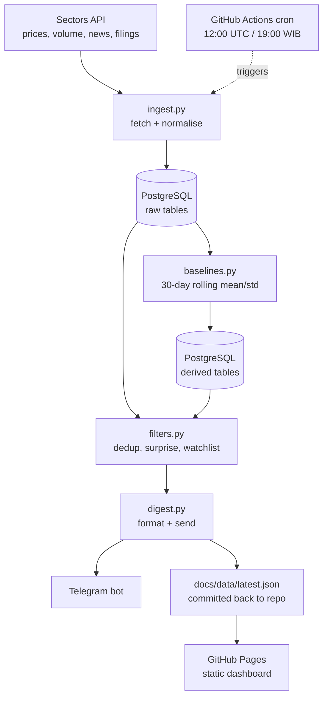
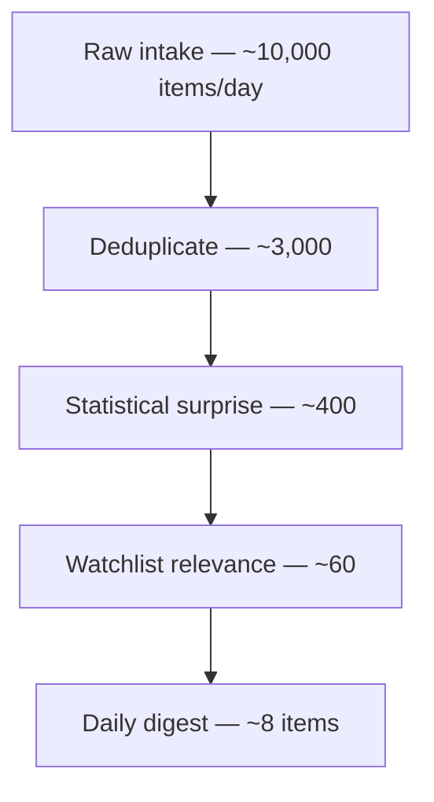

# DESIGN — IDX Daily Signal Filter

**Signal over noise: an automated daily filtering pipeline for IDX market information**

A scheduled autonomous pipeline that ingests IDX market data, filters it down to items
that meaningfully deviate from baseline, and delivers a daily digest via Telegram.

---

## 1. Goal and scope

**Problem.** One corporate announcement produces dozens of near-duplicate articles.
Routine price and volume movement produces a constant stream of low-consequence updates.
The cost is attention spent on information that turned out not to matter.

**What we build.** A job that runs every trading day, reduces raw intake to a handful of
items, and pushes them to Telegram.

**What we explicitly do NOT build:**

| Not building | Why |
|---|---|
| Price prediction | Not the problem. Out of scope. |
| A trading dashboard | Zero rubric points. |
| A live backend API | Second system, own failure modes, no rubric value. |
| LLM scoring (v1) | Add only if time remains after day 15. |

**Claim discipline.** We claim *measurable reduction*, not a solution. In the presentation:
"98% compression at a 4% miss rate" — never "solves information overload."

---

## 2. Rubric mapping

| Rubric requirement | Our implementation |
|---|---|
| Workflow that fires on a market event | Filter conditions trigger digest send |
| Scheduled pipeline, every trading day | GitHub Actions cron, weekdays |
| Bot pushing alerts on defined conditions | Telegram bot, z-score + dedup thresholds |
| CI scheduler / repeatable routine | GitHub Actions with public run history |

**The deadline that matters is day 5, not day 18.** Run history cannot be compressed
later. Twelve green checkmarks across real trading days is the primary evidence of
autonomy. Deploy something trivial early and improve it in place.

---

## 3. Architecture



**Key principle: raw data is stored before analysis.** If filter logic changes, we re-run
on stored history instead of re-fetching. The Sectors API is on a paid quota with 90-day
window limits — re-fetching is expensive and slow.

---

## 4. The filter funnel

Stages are ordered by **ascending computational cost**. Cheap deterministic filters run
first so that expensive operations only touch a small remainder.



### Stage 1 — Deduplication

The single biggest win, and the stage most projects skip. One IDX announcement becomes
40 articles across Kontan, Bisnis, CNBC Indonesia plus social reposts.

- **Method:** TF-IDF vectorisation + cosine similarity, `scikit-learn`
- **Threshold:** cluster if similarity > 0.75 (tune against history)
- **Keep:** earliest-published member of each cluster
- **Expected reduction:** 60–80%

> **Do NOT use `sentence-transformers`.** It pulls in PyTorch (~800MB), downloaded on
> every CI run. TF-IDF is sufficient for near-duplicate headlines and is measured in MB.
> If time remains, swap in embeddings via an API call, never a local model.

### Stage 2 — Statistical surprise

Information is surprise. A number matching expectation carries none.

```python
volume_z = (volume - rolling_mean_30d) / rolling_std_30d
return_z = (daily_return - mean_return_30d) / std_return_30d
```

- **Pass if:** `abs(volume_z) > 2.5` OR `abs(return_z) > 2.0`
- Thresholds are **tuned against labelled history** (section 7), not guessed

### Stage 3 — Watchlist relevance

Does this item touch a symbol in the user's universe? Trivial join, kills most of what
remains.

### Stage 4 — LLM scoring (OPTIONAL, v2 only)

Only build if days 16–17 arrive early. The writeup is *stronger* saying
"cheap statistical filters achieved 98% compression, so no model was needed."

---

## 5. Data model

```sql
-- Raw: one row per symbol per trading day
CREATE TABLE daily_close (
    symbol      TEXT NOT NULL,
    trade_date  DATE NOT NULL,
    close       NUMERIC(20,4) NOT NULL,
    volume      BIGINT,
    market_cap  NUMERIC(24,2),
    fetched_at  TIMESTAMPTZ DEFAULT now(),
    PRIMARY KEY (symbol, trade_date)
);

-- Raw: news and filings
CREATE TABLE news_items (
    id           TEXT PRIMARY KEY,       -- source id or content hash
    symbol       TEXT,
    published_at TIMESTAMPTZ NOT NULL,
    title        TEXT NOT NULL,
    body         TEXT,
    source       TEXT,
    url          TEXT,
    fetched_at   TIMESTAMPTZ DEFAULT now()
);

-- Derived: rolling baselines
CREATE TABLE baselines (
    symbol       TEXT NOT NULL,
    trade_date   DATE NOT NULL,
    vol_mean_30d NUMERIC,
    vol_std_30d  NUMERIC,
    ret_mean_30d NUMERIC,
    ret_std_30d  NUMERIC,
    PRIMARY KEY (symbol, trade_date)
);

-- Derived: every score we computed, kept for re-tuning without re-fetching
CREATE TABLE item_scores (
    item_id      TEXT NOT NULL,
    run_date     DATE NOT NULL,
    dedup_group  TEXT,
    volume_z     NUMERIC,
    return_z     NUMERIC,
    passed_stage TEXT,          -- where it was dropped
    PRIMARY KEY (item_id, run_date)
);

-- Idempotency for the bot: prevents double-sending on re-run
CREATE TABLE sent_digests (
    run_date   DATE PRIMARY KEY,
    sent_at    TIMESTAMPTZ DEFAULT now(),
    item_count INT
);

-- Observability: per-run stage counts (feeds the dashboard)
CREATE TABLE run_log (
    run_date         DATE PRIMARY KEY,
    started_at       TIMESTAMPTZ,
    finished_at      TIMESTAMPTZ,
    status           TEXT,       -- success | failed | no_trading_day
    count_raw        INT,
    count_deduped    INT,
    count_surprising INT,
    count_sent       INT
);
```

**Conventions, agreed day 1:**

- **Symbol normalisation.** Sectors accepts `BBCA`, `bbca`, `BBCA.JK` interchangeably.
  Canonical form is **uppercase, no suffix**. Normalise at the ingestion boundary or you
  will silently get three rows per company.
- **Money is `NUMERIC`, never `FLOAT`.** Floats lose cents.
- **All timestamps stored UTC.** Convert to WIB only at display.
- **Store unadjusted prices.** Keep corporate actions in a separate table; compute
  adjustments in the analysis layer so a late-reported split cannot corrupt history.

---

## 6. Scheduling and reliability

```yaml
# .github/workflows/daily.yml
name: daily-pipeline
on:
  schedule:
    - cron: '0 12 * * 1-5'    # 19:00 WIB, weekdays
  workflow_dispatch:           # manual trigger — keep for live demo
permissions:
  contents: write              # needed to commit docs/data/latest.json
```

> GitHub's free-tier cron can drift 10–30 minutes. Irrelevant for a daily job.
> `workflow_dispatch` lets you trigger a live run during the presentation — a far better
> demo than a screenshot.

**The reliability layer is our differentiator, not the algorithm.** "Repeatable routine
running autonomously" is a reliability claim, so build what makes it true:

| Requirement | Implementation |
|---|---|
| Non-trading days exit clean | Log `no_trading_day`, return success. No crash, no alert. |
| Idempotency | `(symbol, trade_date)` PK for DB; `sent_digests` for the bot |
| Retry with backoff | Wrap Sectors calls; the API will time out occasionally |
| Dead man's switch | If no successful run by cutoff, send a **failure** message |
| Structured logs | Write `run_log` each run — doubles as evaluation data |

**The dead man's switch is the subtle one.** A silent failure looks identical to "no
alerts today." Being able to explain that distinction in the presentation signals real
thinking about autonomous systems.

---

## 7. Evaluation

We have ground truth, which most filtering projects lack.

For a news item at time `T`, measure the stock's return from `T` to `T+1` normalised by
its own recent volatility. Moved 3σ → the news mattered. Moved 0.2σ → it did not. This
gives a **label**, and therefore a tunable objective.

**Metrics:**

| Metric | Definition | Why |
|---|---|---|
| Compression ratio | `1 - (sent / raw)` | The headline number |
| **Miss rate** | Of items *suppressed*, % preceding a material move | **The one that matters** |
| Open rate | Of items sent, % the user opened | Usefulness signal |

**Costs are asymmetric.** A filter sending 5 useful items a day is worthless if it
silently drops the announcement that moved a position 12%. Optimise miss rate, not
precision.

**Deliverable:** one paragraph in the writeup defending thresholds with evidence —
*"volume threshold set at 2.5σ because at 2σ the digest averaged 40 items, and at 3σ it
missed two moves above 5%."* Graders notice when thresholds are defended rather than
guessed.

---

## 8. Repository layout and ownership

```
.
├── .github/workflows/daily.yml
├── src/
│   ├── ingest.py          # A — Sectors fetch, normalise, write raw
│   ├── baselines.py       # B — rolling mean/std
│   ├── filters.py         # B — dedup, surprise, watchlist
│   ├── digest.py          # C — format + Telegram send
│   └── db.py              # SHARED — agree schema day 1
├── sql/schema.sql         # SHARED
├── scripts/backfill.py    # A — one-time history load
├── fixtures/
│   ├── sample_digest.json # day 1 — unblocks frontend
│   └── sample_runs.json
├── docs/                  # D — GitHub Pages static dashboard
│   ├── index.html
│   └── data/latest.json   # written by the pipeline
├── .env.example
├── .gitignore
└── requirements.txt
```

**Assign files, not features.** Merge conflicts across four people on a two-week deadline
cost more time than anyone expects. `db.py` and `schema.sql` are the exception — settle
them on a call on day 1, because every other track is blocked until they exist.

### Team split (4 members)

| Track | Owner | Deliverable |
|---|---|---|
| Ingestion + DB | A (Cleon) | `ingest.py`, `backfill.py`, `db.py`, schema |
| Filters + CI | B | `baselines.py`, `filters.py`, `daily.yml` |
| Delivery | C | Telegram bot, digest formatting |
| Observability | D | GitHub Pages dashboard |

**The frontend pair visualise the *system*, not the market.** A BBCA price chart is
decoration. Run history, per-stage filter counts, and a digest archive are direct evidence
of the thing the rubric grades. Same skills, same work — but it becomes proof rather than
garnish.

### Contract: fixture-first

Commit fixtures on **day 1** so C and D are never blocked waiting for real output.

```json
{
  "run_date": "2026-09-14",
  "status": "success",
  "stages": { "raw": 8420, "deduped": 2910, "surprising": 387, "watchlist": 54 },
  "items": [
    {
      "symbol": "BBCA",
      "headline": "...",
      "url": "https://...",
      "volume_z": 4.2,
      "return_z": 1.1,
      "reason": "volume anomaly"
    }
  ]
}
```

Twenty minutes agreeing this shape buys parallel progress for the whole project.

---

## 9. Stack

| Piece | Choice | Note |
|---|---|---|
| Python | 3.11 or 3.12 | Pin the same version in CI |
| Deps | `requirements.txt`, pinned | `uv` is nicer, not worth setup cost in 18 days |
| HTTP | `requests` | No async need |
| DB driver | `psycopg2-binary` + raw SQL | Skip the ORM, queries are simple |
| Analysis | `pandas`, `numpy` | Rolling baselines, z-scores |
| Dedup | `scikit-learn` TfidfVectorizer | See warning in section 4 |
| Telegram | `requests` to Bot API | Library unnecessary for send-only |
| Config | `python-dotenv` | Mirrors GitHub Secrets |
| Hosting | Supabase or Neon | Free Postgres tier |

**Sectors API notes:**

- Base URL `https://api.sectors.app/v2/`
- Auth is a **bare** `Authorization: <key>` header — *not* `Bearer <key>`
- Requires a paid Insider plan — **confirm access within 24 hours**, it is the only
  blocker that cannot be engineered around
- Use **Daily Full-Universe Close** for the nightly job: every ticker in one paginated
  feed instead of ~900 per-symbol calls
- Window limits: 90 days on most range endpoints, **14 days** on broker activity
- Fallback if the key falls through: `yfinance` with `.JK` suffixes — loses news and
  broker data, keeps the statistical side

**Secrets, non-negotiable:** `.env` in `.gitignore` from the first commit,
`.env.example` committed with empty values, real values in GitHub Secrets. Rotating a
leaked paid key is the easy part; scrubbing git history is not.

---

## 10. Timeline (18 days)

| Days | Work | Gate |
|---|---|---|
| 1 | Confirm API key. Agree schema + fixture shape on a call. Commit fixtures. | Fixtures in repo |
| 1–2 | `ingest.py` — close + news for ~40 tickers | Data in DB |
| 3 | **Deploy to GitHub Actions**, even if it only writes to the DB | **First green run** |
| 4–6 | Baselines, dedup, surprise thresholds | Filter v1 |
| 7–8 | Telegram bot, digest formatting | **Live digest sending** |
| 9–12 | Reliability layer — accumulates run history while you work | 8+ green runs |
| 13–15 | Tune thresholds against labelled history; dashboard lands | Metrics computed |
| 16–17 | README, writeup, rehearse demo | Submission ready |
| 18 | Buffer | Something will break |

**Day 3–5 is the only non-negotiable date.** The version of this that goes wrong is
spending days 1–8 perfecting filter logic because it is the interesting part, then
deploying on day 12 with a beautiful algorithm and four green checkmarks.

**Scope the data hard.** One fixed watchlist of 30–50 tickers, not the full universe. At
the 90-day window limit that is ~4 calls per ticker for a year of history — roughly 160
calls, minutes to run. The full universe would consume the entire first week.

---

## 11. Risks

| Risk | Mitigation |
|---|---|
| Sectors key unavailable | Decide by day 1. Fallback: `yfinance` `.JK` |
| Late deploy → no run history | Day 3 gate. Deploy trivial, improve in place |
| Frontend becomes a blocker | Stated rule: day-5 deploy does not wait for dashboard |
| CI env differs from local | First deploy takes longer than feels reasonable. Budget it |
| Timezone bugs (UTC cron vs WIB) | Store UTC everywhere, convert only at display |
| Scope creep | Section 1 lists what we are not building. Re-read it weekly |
| Silent job failure | Dead man's switch |

---

## 12. Presentation notes

- Trigger a live run with `workflow_dispatch` during the demo
- Screenshot the Actions run history — the column of green checks **is** the deliverable
- Lead with the compression ratio and miss rate, not the architecture diagram
- If asked "does this solve information overload?" — no, it reduces it, and here is the
  measured reduction
